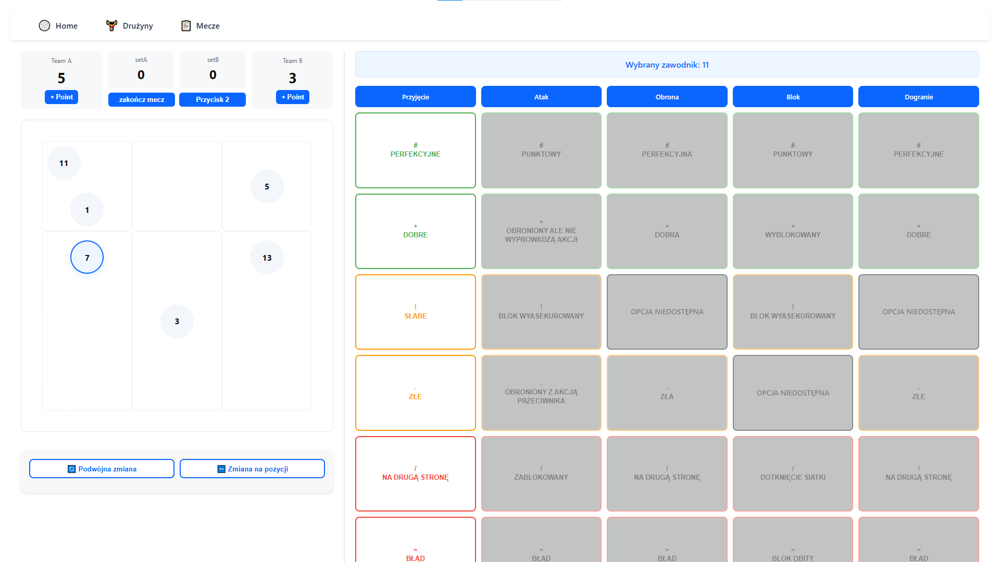
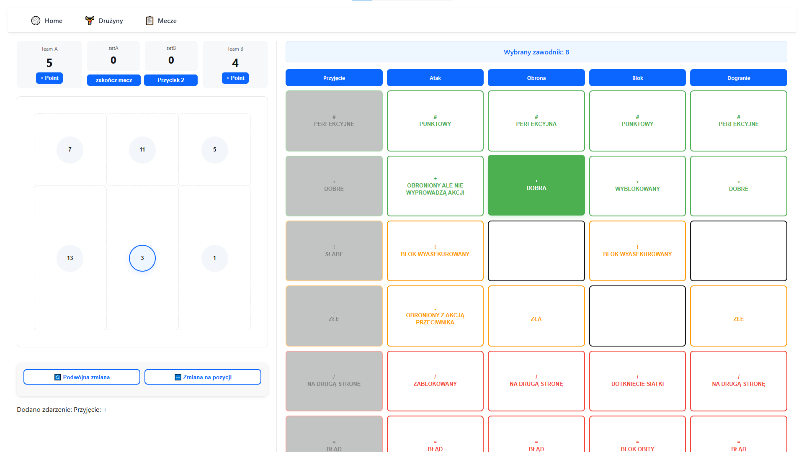
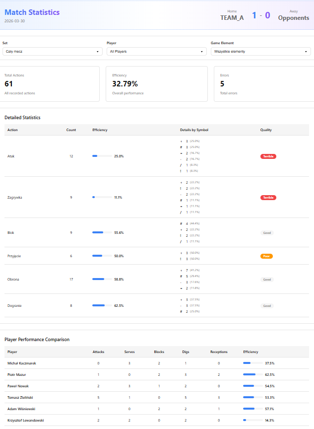

# Volleyball Stats

A web application for tracking and analyzing volleyball match statistics. Built with a **React (JavaScript) frontend** and a **Python (Flask) backend**, it allows users to record live match events, view player performance, and generate match summaries.

## Features

- **Live match tracking** – record points, kills, blocks, serves, and errors in real time.
- **Player statistics** – maintain profiles and calculate per‑match and aggregate stats.
- **Match history** – store completed matches and review past performances.
- **Responsive dashboard** – visualize data with charts and tables.
- **RESTful API** – backend provides endpoints for match and player data.

## Tech Stack

- **Frontend**: JavaScript (React), HTML5, CSS3  
- **Backend**: Python (Flask)  
- **Database**: SQLite (local file)  
- **Other**: REST API, Axios, Chart.js

## Getting Started

### Prerequisites

- Node.js (v14 or later)
- Python (v3.8 or later)
- pip (Python package manager)

### Installation

1. **Clone the repository**
   ```bash
   git clone https://github.com/grzesryba/volleyball-stats.git
   cd volleyball-stats
   ```

2. **Backend setup**
   ```bash
   cd backend
   python -m venv venv
   source venv/bin/activate   # On Windows: venv\Scripts\activate
   pip install -r requirements.txt
   uvicorn main:app --reload   # Runs on http://localhost:8000
   ```

3. **Frontend setup (optional)**
   If you want to run the frontend separately (for development):
   ```bash
   cd ../frontend
   npm install
   npm start   # Runs on http://localhost:3000, proxies to backend
   ```

4. **Access the application**
   - If you only started the backend, open `http://localhost:8000` (the backend serves the frontend as well).
   - If you started both, open `http://localhost:3000`.

### Database

The application uses an **SQLite database** that is automatically created on first run.  
The database file is stored in:

```
~/VolleyballStats/volleyball.db
```

- On Windows: `C:\Users\<YourUsername>\VolleyballStats\volleyball.db`  
- On macOS/Linux: `/home/<YourUsername>/VolleyballStats/volleyball.db`

Initial tables and seed data (positions, game elements, result symbols) are created automatically – no manual setup is required.

#### Database Schema

  

## Usage

- **Create a match** – add teams and players.
- **Track actions** – during a match, click buttons to record kills, blocks, serves, etc.
- **View stats** – after the match, see detailed statistics for each player and team.
- **History** – browse previous matches and re‑visit their stats.

## Screenshots

Receiving opponent’s serve:



During an action:



Example statistics for random data from a few points:



## Contact

Project maintainer: **Grzegorz Rybiński** – [GitHub profile](https://github.com/grzesryba)
